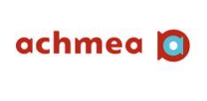

# Hello world, hello Microsoft! 

 https://data.gy - Jakob Serlier 2021 

## Transforming an individuals' life, businesses and organizations through Microsoft services 

### Scoping down - from an organizational level to a service level

Many products and services lie at the heart of Microsoft. With your corporate mission being "Empower every person and every organization on the planet to achieve more.", I wanted to find out what that means for individual businesses. 

**Four focus area's for the digital transformation:**

<!--  -->

  

---

## Why is digital innovation important?

  

  

  

<!--  -->

<!--  -->

<!--  -->

> Tech Intensity Quantitative Research, Microsoft, 2019

A digital transformation allows clients to improve upon their current business proposition, and in addition re-imagine what the future of their business can look like. 

---

## How does the transformation influence people from a customer perspective? Three case studies of existing clients

### Case study: IoT for Achmea

  

  

  

<!-- 

 -->

> https://customers.microsoft.com/en-us/story/814287-achmea

---

### Case study:  AI for health care at apoQlar

  

  

<!-- 

 -->

> Microsoft, A Year of Change: Digital Transformation Trends in 2020 10

---

### Case study: building upon innovative idea's together with Carnegie Mellon University

  

  

<!-- 

 -->

> https://customers.microsoft.com/en-us/story/1373322602397569038-cmu-azurepmm-azurestack

---

## What the future will bring: from case studies to the edge of innovation

  

  

<!-- 

 -->
